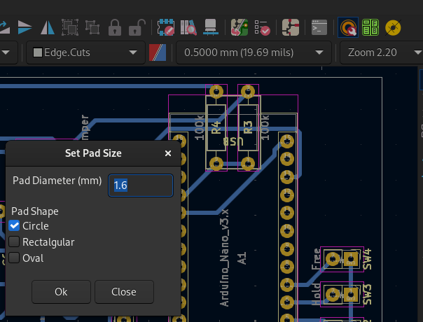

#  Set Pad Size plugin for KiCad

## Description
The `Set Pad Size` plugin is a KiCad action plugin that edits the pad size of all pads in the PCB to a unique size. The default value is 1.6mm. 

**Why?** When manufacturing PCBs by hand (whether trough chemical etching or CNC milling), it's important to guarantee that pads have enough area so that they are not completly removed during fabrication. A good Pad size for through hole components is 2mm diameter (for drilling hole from 0.5mm to 1mm). Most footprints have Pads with a diameter of 1.6mm or less.

## Installation

### Manual Installation

1. Clone this repository or download the latest release.
2. Copy the `plugins` subdirectory to your KiCad plugins directory. eg
   
```
cp -rp plugins <your_kicad_plugin_directory>/setpadsize
```

3. Restart KiCad or use `Tools > External Plugins > Refresh Plugins` from the PCB Editors menu

## Usage
1. Open your PCB project in the KiCad PCB editor.
2. Go to `Tools > External Plugins > Set Pad Size` to run the plugin.



## License
This project is licensed under the GNU GPL Version 3 License - see the [LICENSE](LICENSE) file for details.

## Author
Pablo Cremades (based on [Set Hole Diameter](https://github.com/seigedigital/setholediameterpluginforkicad/tree/main) plugin by Leander Seige, seige.digital GbR)
